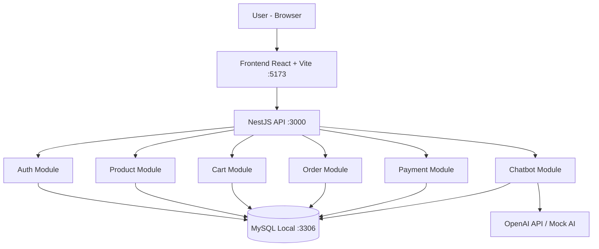

# Task 1 - Chọn kiến trúc và System Architecture Diagram

## Kiến trúc chọn
Modular Monolith (NestJS) cho môi trường local.

## Lý do
- Dễ triển khai, dễ demo, chi phí thấp
- Phù hợp quy mô đồ án và 50 users đồng thời
- Dễ mở rộng sau này

## Mermaid Diagram

